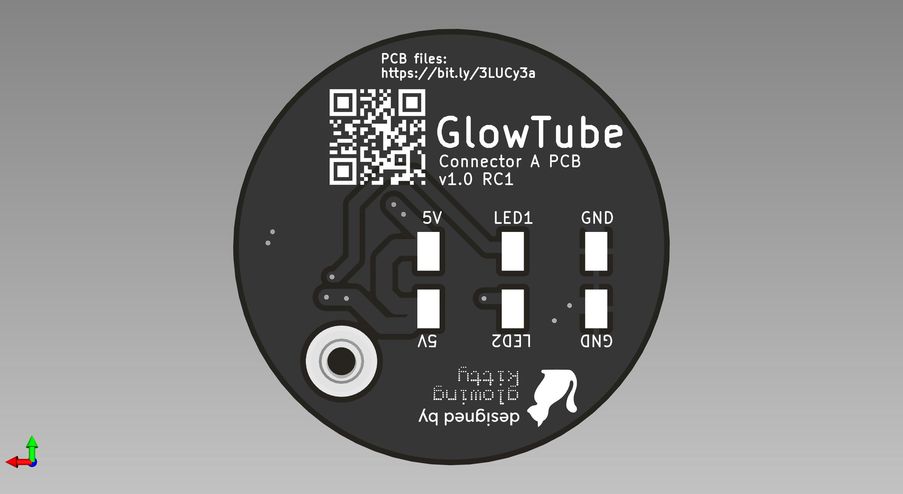

# GlowTube Connector A PCB

The first connecting PCB inside GlowTube. For connecting the LED strips with the main PCB of GlowTube.

## Links

- [Schematic](https://github.com/glowingkitty/GlowTube/blob/main/GlowTubeLEDconnectorA_PCB/GlowTubeLEDconnectorA_PCB.pdf)