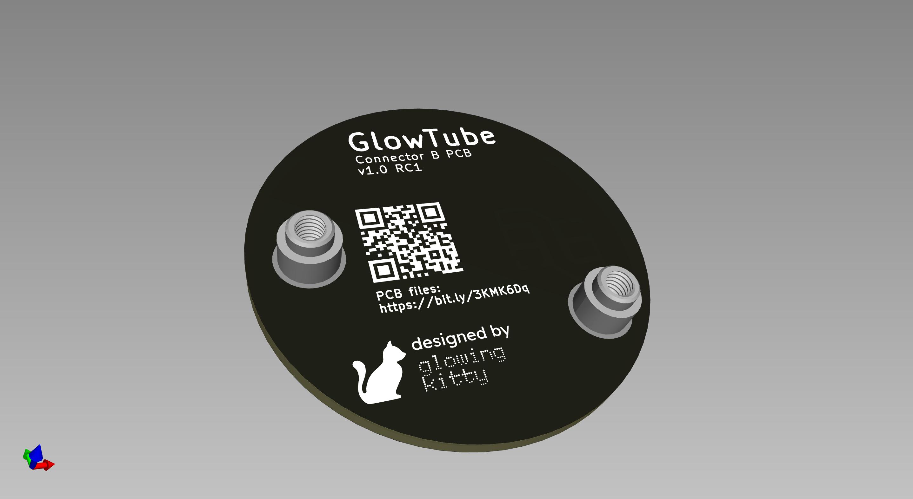
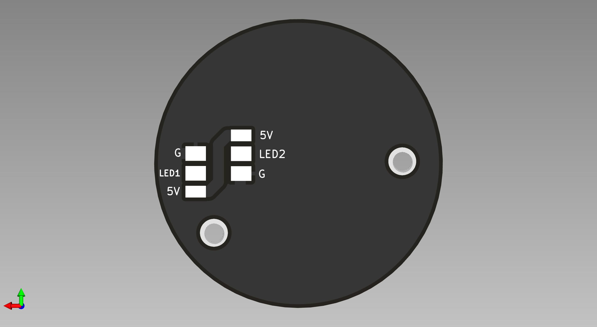

# GlowTube LED connector B PCB

The second connecting PCB, to connect two LED strips with each other.

## Links

- [Schematic](https://github.com/glowingkitty/GlowTube/blob/main/GlowTubeLEDconnectorB_PCB/GlowTubeLEDconnectorB_PCB.pdf)