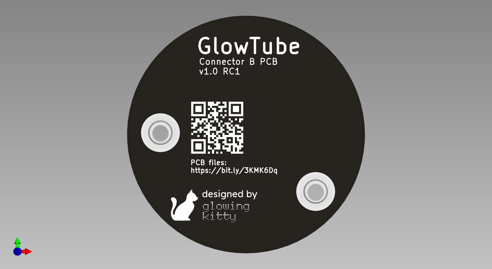

# GlowTube Connector B PCB

The second connecting PCB inside GlowTube. For stabilizing the LED strips.

## Links

- [Schematic](https://github.com/glowingkitty/GlowTube/blob/main/GlowTubeLEDconnectorB_PCB/GlowTubeLEDconnectorB_PCB.pdf)