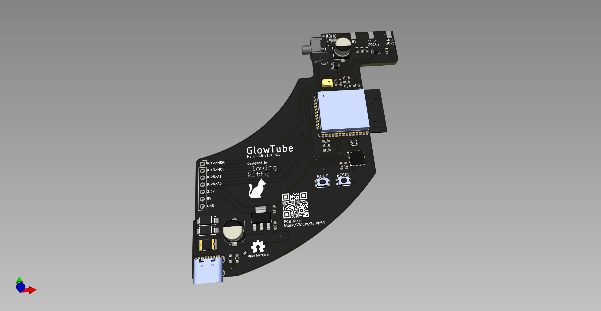

# GlowTube Main PCB

The main PCB for GlowTube, controlling and powering the connected LEDs.

## Links

- [Schematic](https://github.com/glowingkitty/GlowTube/blob/main/GlowTubePCB/GlowTube.pdf)
- [Interactive BOM](https://htmlpreview.github.io/?https://github.com/glowingkitty/GlowTube/blob/main/GlowTubePCB/bom/ibom.html)
- [PCB stencils](https://github.com/glowingkitty/GlowTube/blob/main/GlowTubePCB/PCB%20stencils)