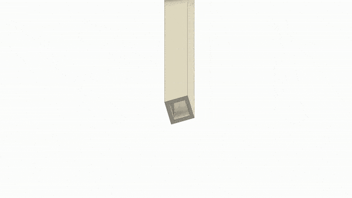
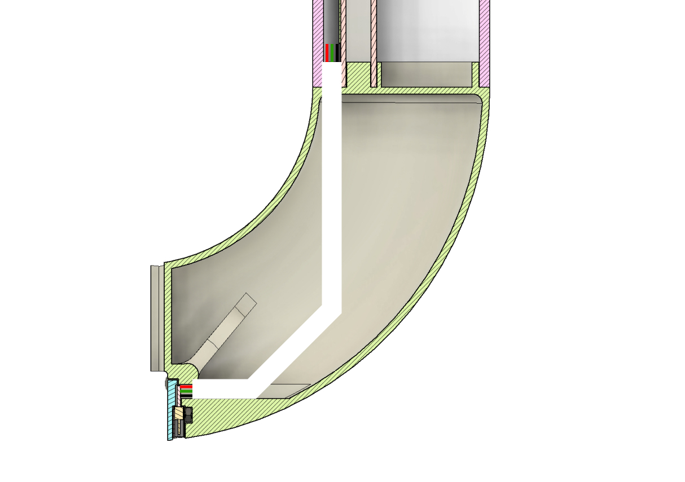
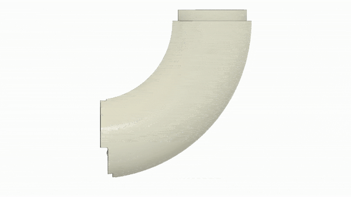
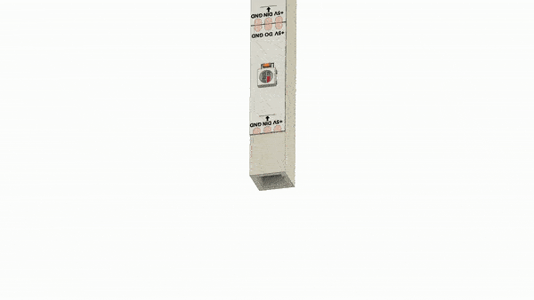
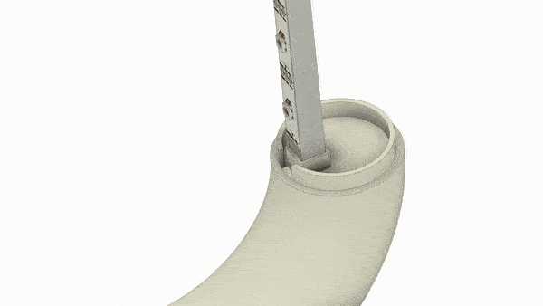
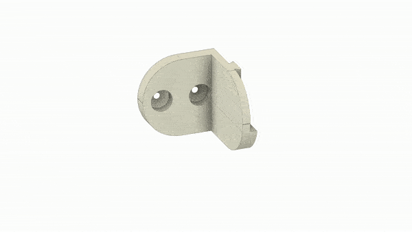
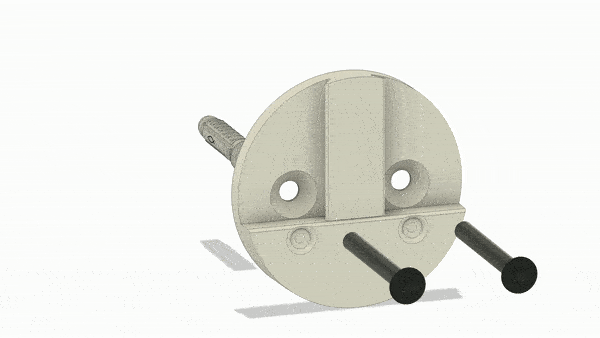
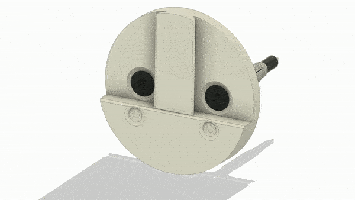

## What is this project?

A beautiful-looking LED lamp for your wall. With an acrylic tube that diffuses the light and makes it look as if the whole tube glows. To make the GlowTube light up, just connect it with a USB-C cable to your [GlowHub](https://github.com/glowingkitty/GlowHub). GlowHub allows you to control up to 4 GlowTubes at the same time, with the powerful WLED software. Oh, and did I mention that animations on GlowTube can also react to music, with the help of GlowHub?

Want to double-check if you are building it correctly? [Download the "GlowTube.step" file from GrabCAD](https://grabcad.com/library/glowtube-1)

## Required tools

- 3D printer (tested with MSLA 3d printer, but every other 3D printer should work as well. With a minimum print area of 12x13x15cm)
- hot air gun (or a lighter)
- screwdriver (for M2 screws)
- soldering equipment

## Required materials

- **min. 150ml** of 3D printing resin (or similar amount of filament, if you use an FDM printer)
- **1m** acrylic tube, 50mm outer diameter, 44mm inner diameter (frosted)
- **1m** WS2812B LED strip (30 LEDs per meter)
- **1m** aluminum tube (10mm x 10mm)
- **1m** heat shrinking tube, transparent (2:1, 9,5mm/19mm)
- **15cm** heat shrinking tube, white (3:1, 4mm/12mm)
- **1x** USB-C female connector JRC-B008
- **2x** M2 nuts
- **2x** M2 6mm screws flat head
- **2x** dowels (ø5)
- **2x** screws (25mm long recommended)
- wires (ideally in white)

## How to build the GlowTube

### **Step 1:** Print the parts

First, 3D print all the .3mf case parts (or alternatively use the .stl files) in [/3D printed parts](https://github.com/glowingkitty/GlowTube/tree/main/3d%20printed%20parts), with an SLA/MSLA printer or FDM printer.

### **Step 2:** Tape LEDs to aluminum tube

Now let's prepare the LED strip - just tape the WS2812B LED strip in the middle of the aluminum tube, on one of the four sides.

### **Step 3:** Prepare LED strip cable

Take three (ideally white) wires and place them inside a white heat shrinking tube flat next to each other. Make sure the wires are 2-3 cm longer on both sides than the heat shrinking tube. Then use a hot air gun to make the heat shrinking tube shrink, with the three wires inside flat next to each other. It's important that the resulting cable is flat and not round, so it can fit into the opening of the GlowTube bottom connector. Now, move the white cable through the bottom_connector, starting at the hole at the top of the connector. This might take a few tries and some patience. 

### **Step 4:** Add USB-C board

Next, take the USB-C board and add some solder to all the pads - while also soldering the D- and D+ pads together. Also add some solder to the ends of the wires, before then soldering the wires to the USB-C board - one wire to G (ground), one to V (voltage), and one to both D- and D+ (data). Make sure the wires are soldered to the board at as close to a 90 degrees angle as possible. Add the M2 nuts into the bottom_connector, before you then place the USB-C board in its final position, with the bottom_usb-c_cover on top, and screw it all together.

### **Step 5:** Connect USB-C board to LED strip

On the other side of the bottom_connector, solder the wires to the WS2812B LED strip. Make sure you solder the correct wire to the correct pin. If you place the wires inside the white heat shrinking tube completely flat, they should now be in reversed order (G and V are switched). Once you soldered the wires, surround the soldering connection with white heat shrinking tube. Now add a 1cm long transparent heat shrinking tube around the connector part where the aluminum tube gets slid into. Now slide in the aluminum tube with the LED strip (make sure the arrow on the WS2812B LED strip points away from the connector), squeeze the wires into the bottom_connector, and cover all the LEDs with a transparent heat shrinking tube - before you then use a hot air gun to make the heat shrinking tube shrink and fixate the aluminum tube, LED strip and bottom_connector.

### **Step 6:** Finish the GlowTube

Now slide the acrylic tube carefully on the bottom_connector and the top_connector on top of the acrylic tube and aluminum tube. Done! Your GlowTube is now ready to be mounted! To be safe, connect the GlowTube with a USB-C cable to the GlowHub (and power the GlowHub with power) - to make sure everything works.

## How to mount the GlowTube

### **Step 1:** Prepare the wall

Take the two wall_mount_templates and slide them into your GlowTube, at the top and bottom. Now position the GlowTube at the height and angle where you want it to stay on your wall - and mark the four screw holes, with a pen. Take the GlowTube from the wall and drill the holes with a 5mm drill bit. Now place the dowels inside the holes.

### **Step 3:** Fixate the wall mount

Take the wall_mounts and screw them to the wall. Make sure to place the botttom_wall_mount at the bottom and the top_wall_mount at the top.

### **Step 4:** Slide in & connect the GlowTube

And the last step: remove the wall_mount_templates from your GlowTube and slide the GlowTube with carefully applied pressure into the wall mounts. Done! Now connect your GlowTub with a USB-C cable to the GlowHub (and supply your GlowHub with power) and you are ready to glow!

Have fun and let it glow!